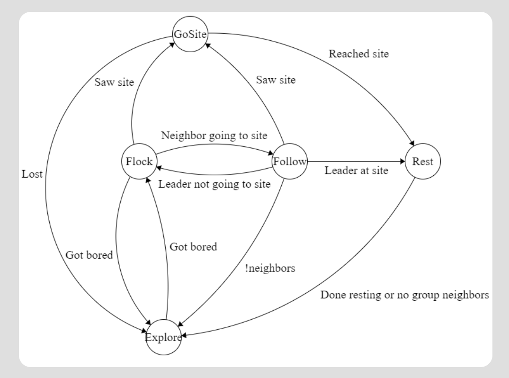

# fission_fusion_v2

## Overview
- Introduction
- Running the Program
- References

## Introduction
This is an attempt to model the behavior of a herd looking for food (think buffalo finding grazing sites). Agents are sorted into different groups (currently hardcoded to 3 groups) and will herd with members of their own group. These groups are represented by three colors: cyan, yellow, and magenta. They then explore a world with a configurable number of grazing sites, represented by large green dots, of different sizes and resource amount. Agent behavior was originally modeled using a finite state machine; a behavior tree implementation is currently a work in progress. Done as part of a research project with Dr. Michael A. Goodrich at Brigham Young University, 2023-2024.

### The FSM Model

## Running the Program
1. Using the terminal, navigate to the <code>fission_fusion_v2</code> directory on your computer. It should be the same directory that this <code>README.md</code> is in.
2. If this is the first time running the program on your machine, enter <code>pip install -r requirements.txt</code>. This should install the basic dependencies you need to run the FSM version. Follow the directions at https://github.com/splintered-reality/py_trees?tab=readme-ov-file#getting-started to install the py_trees package. (This codebase uses py_trees version 2.2.3)
3. (Optional) Change the simulation configuration in <code>config.py</code>.
4. Enter <code>python pygame_display.py.</code> NOTE: the <code>matplotlib_display.py</code> is obsolete. It has significant performance issues compared to the <code>pygame</code> implementation of the display. It is highly recommended you do not use it.
5. Enjoy watching the simulation! You can quit the simulation by either closing the <code>pygame</code> window, or typing <code>ctrl_c</code> in the terminal.

### Gathering Data
This codebase also supports gathering empirical data via <code>run_experiment.py</code>. The data is saved in a .txt, a .npy array, and a .jpg box-and-whiskers graph. The data is automatically saved to a new <code>experiment_results</code> directory under the parent directory of <code>fission_fusion_v2</code>. The experiment measures:
- The mean starting and ending hunger of each agent per trial
- The mean difference between starting and ending hunger per trial
- The mean amount of resources available at each site per iteration overall

To run experiments:
1. Do step 1 and 2 of the initial "Running the Program"
2. (Optional) Change the simulation configuration in <code>config.py</code>
3. In <code>run_experiment.py</code>, enter in the name you would like your files to have.
4. Enter <code>python run_experiment.py</code> into the terminal and wait for your results!

### <code>config.py</code>
Simulation settings can be changed by changing the constants in <code>config.py</code>. Of particular note are <code>USE_BT</code> and <code>USE_BOID_MOVE</code>. <code>USE_BT</code> will create a simulation using the Behavior Tree implementation of agent models. <code>USE_BT</code> is defaulted to <code>False</code>. <code>USE_BOID_MOVE</code> determines how the agents will move (in the FSM version only as of 4/25/2024). Agents will either move in a true Boids-like fashion, or fuse/diffuse using the graph laplacian, which exhibits greater self-sorting at the cost of range of movement. <code>USE_BOID_MOVE</code> is defaulted to <code>True</code>.

## Work in Progress
### Non-functional
Currently, the following files are not functional, and should not be used:
- pygame_sim.py
- ./World/Sprites
### <code>behaviors.py</code> and <code>bt_construction.py</code>
The behavior tree implementation is functional, but it is still a major work in progress. Expect most changes to be in these two files.

## References
Brown, D. S., Kerman, S. C., & Goodrich, M. A. (2014). (2014). Human-swarm interactions based on managing attractors. Paper presented at the Proceedings of the 2014 ACM/IEEE International Conference on Human-Robot Interaction, Bielefeld, Germany. 90–97. https://doi.org/10.1145/2559636.2559661 - The agents' "boids" movement was based on the math in this paper
